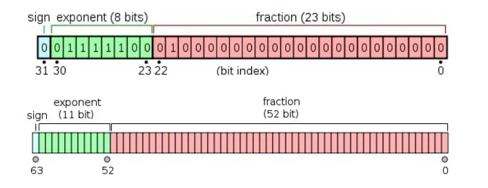

# 大体笔记

## VS快捷键

[VS中常用的快捷键](https://blog.csdn.net/mrlisky/article/details/72622009)

* 按F10可以调试代码，一直按F10就可以逐语句调试了。
* F11可以逐语句调试，比F10更细致——可以进入函数体里面去。
* 按F5可以运行项目。
* 搜狗输入法输入`shijian`可以显示日期 + 时间。 
* 点击调试——窗口——监视，可以看到变量的执行过程变化(需要先按F5或F10或F11进行调试,必须要先调试起来才能在窗口里看到更多东西)
* F9可以打断点。

## 单精度和双精度的区别

单精度型和双精度型的区别在于它们的精确程度不一样，也就是小数部分的有效位数不一样。

单精度数（float型）在32位计算机中存储占用4字节，也就是32位，有效位数为7位，小数点后6位；双精度数（double型）在32位计算机中存储占用8字节，也就是64位，有效位数为16位，小数点后15位。

比如3.1415926535897932384这个小数，如果定义成float型，那么只会留下小数点后5位，也就是3.141592，如果定义成double型，那么只会留下小数点后15位，也就是3.141592653589793。



## size_t类型

在C语言中，size_t是一种无符号整数类型，通常用于表示内存中对象的大小或元素的数量。它的大小取决于编译器和操作系统的位数，通常是32位或64位。

size_t类型通常用于以下情况：

1. 用于表示内存中对象的大小，例如malloc函数返回的指针所指向的内存块的大小。

2. 用于表示数组或缓冲区的元素数量，例如strlen函数返回的字符串长度。

3. 用于表示文件或流中的字节数量，例如fread函数读取的字节数。

使用size_t类型可以确保在不同平台上的程序的可移植性和正确性。

## 结构体定义

结构体定义由关键字 struct 和结构体名组成，结构体名可以根据需要自行定义。

struct 语句定义了一个包含多个成员的新的数据类型，struct 语句的格式如下：

~~~c
struct tag { 
    member-list
    member-list 
    member-list  
    ...
} variable-list ;
~~~

**tag** 是结构体标签。

**member-list** 是标准的变量定义，比如 int i; 或者 float f;，或者其他有效的变量定义。

**variable-list** 结构变量，定义在结构的末尾，最后一个分号之前，您可以指定一个或多个结构变量。下面是声明 Book 结构的方式：

~~~c
struct Books
{
   char  title[50];
   char  author[50];
   char  subject[100];
   int   book_id;
} book;  
~~~

在一般情况下，**tag、member-list、variable-list** 这 3 部分至少要出现 2 个。以下为实例：

~~~c
//此声明声明了拥有3个成员的结构体，分别为整型的a，字符型的b和双精度的c
//同时又声明了结构体变量s1
//这个结构体并没有标明其标签
struct 
{
    int a;
    char b;
    double c;
} s1;

//此声明声明了拥有3个成员的结构体，分别为整型的a，字符型的b和双精度的c
//结构体的标签被命名为SIMPLE,没有声明变量
struct SIMPLE
{
    int a;
    char b;
    double c;
};
//用SIMPLE标签的结构体，另外声明了变量t1、t2、t3
struct SIMPLE t1, t2[20], *t3;

//也可以用typedef创建新类型
typedef struct
{
    int a;
    char b;
    double c; 
} Simple2;
//现在可以用Simple2作为类型声明新的结构体变量
Simple2 u1, u2[20], *u3;
~~~

在上面的声明中，**第一个和第二声明被编译器当作两个完全不同的类型**，即使他们的成员列表是一样的，如果令 t3=&s1，则是非法的。

结构体的成员可以包含其他结构体，也可以包含指向自己结构体类型的指针，而通常这种指针的应用是为了实现一些更高级的数据结构如链表和树等。

## 结构体标签和结构变量的区别

结构体标签和结构变量的区别如下：

1. 内存分配：**结构体标签**不分配内存，而**结构变量**在定义时需要分配内存。
2. 赋值、存取和运算：**结构体标签不能进行赋值、存取和运算**，而**结构变量**可以进行这些操作。
3. 嵌套：结构体可以嵌套，而结构体标签不可以。
4. 引用方式：不能对结构体标签整体赋值或输出，只能分别对各个成员进行引用。而**结构变量可以进行整体赋值或输出，也可以对各个成员进行引用**。

综上所述，结构体标签和结构变量的主要区别在于内存分配、赋值、存取和运算、嵌套以及引用方式等方面。

## 结构体疑问

**疑问**：C语言中定义一个结构体，在结构体内部定义结点的指针域，类型这个是结构体类型，这个为什么不会导致循环定义？因为这个结构体还没定义完，为什么可以在结构体内部使用这个结构体类型呢

**回答**：结构体是嵌套定义的。结构体是没有递归的，因为如果你结构体套用递归的话，你将无法判断结构体所占内存的大小。**编译器读程序是从上到下的，读到第一行结构体类型定义时，会假定这个结构体类型已经存在，于是下面就可以使用这个类型。**

在C语言中，结构体的定义是可以分开进行的。也就是说，我们可以先定义一个结构体类型的名称，然后再在结构体内部使用这个名称来定义结构体的成员。

例如，下面的代码定义了一个结构体类型Node，其中包含一个指向Node类型的指针next：

```c
struct Node;
typedef struct Node Node;

struct Node {
    int data;
    Node *next;
};
```

**在这个例子中，我们先定义了一个Node类型的名称，然后在结构体内部使用了这个名称来定义next成员。由于我们已经定义了Node类型的名称，所以在结构体内部使用这个名称不会导致循环定义的问题。**

需要注意的是，如果我们在结构体内部直接使用结构体类型的名称而没有先定义这个名称，就会导致循环定义的问题。例如，下面的代码就会导致编译错误：

```c
struct Node {
    int data;
    struct Node *next; // 错误：结构体类型未定义
};
```

因为在结构体内部使用了未定义的结构体类型名称。

## 有关&疑问

~~~c
for (int j = 0; j < k; j++) {
	scanf_s("%s %d", stu[num].id, &stu[num].score);
    //为什么第一个stu[num].id前面不加&
}
~~~

`scanf_s` 函数的用法在这里用于读取格式化输入，并把它存入变量中。当你使用 `scanf_s` 读取字符串时（使用 `%s` 格式说明符），你提供的是一个字符数组的地址，即字符串变量的名字。字符串变量名在 C/C++ 中本身就是地址，所以不需要使用 `&` 运算符来获取它的地址。

对于 `stu[num].id`，假设 `stu` 是一个结构体数组，`id` 是一个字符数组（即字符串）用于存储学生的 ID。因为 `id` 已经是一个数组，所以 `stu[num].id` 给出的是该数组的首地址，即指向数组第一个元素的指针。

相比之下，`&stu[num].score` 用于获取 `score` 变量的地址，因为 `score` 可能是一个整数或其他基本数据类型，需要使用 `&` 运算符来获取其内存地址。

简而言之：

* 对于字符串（字符数组），变量名本身就是地址，所以不需要 `&`。
* 对于其他基本数据类型（如 `int`, `float` 等），需要使用 `&` 来获取变量的地址。

## 代码问题

~~~c
struct Student{
	char id[15];  //准考证号
	int score;    //分数
	int location_number;   //考场号
	int local_rank;   //考场内排名
} stu[30010];sort(stu, stu + num, cmp);   //将所有考生排序什么意思
~~~

这段代码定义了一个结构体 `Student`，该结构体包含四个成员：一个用于存储准考证号的字符数组 `id`，一个整数 `score` 用于存储分数，以及两个整数 `location_number` 和 `local_rank` 分别用于存储考场号和考场内排名。

此外，代码中还定义了一个 `stu` 数组，该数组可以存储最多 30010 个 `Student` 结构体实例。

`sort(stu, stu + num, cmp);` 这行代码用于对 `stu` 数组中的元素进行排序。这里使用了 C++ 的标准库函数 `sort`。该函数接受三个参数：

1. 要排序的元素的起始地址。
2. 要排序的元素的结束地址（不包括该地址）。
3. 一个比较函数或可调用对象，用于定义排序的顺序。

这里的 `cmp` 应该是一个比较函数或可调用对象，用于定义如何比较两个 `Student` 结构体实例。不过，由于 `cmp` 在提供的代码段中没有定义，我无法给出它的具体实现和作用。

需要注意的是，如果你在代码中直接使用了 `sort` 函数，你需要包含 `<algorithm>` 头文件。

总的来说，这行代码的意思是：根据某种顺序（由 `cmp` 定义）对 `stu` 数组中的 `Student` 结构体实例进行排序。

## C语言的sort函数用法

`sort()`函数可以对给定区间所有元素进行排序。它有三个参数`sort(begin, end, cmp)`，其中begin为指向待sort()的数组的第一个元素的指针，end为指向待sort()的数组的最后一个元素的下一个位置的指针，cmp参数为排序准则，cmp参数可以不写，如果不写的话，默认从小到大进行排序。

## C语言strcmp()函数：比较两个字符串

C语言 strcmp() 函数用于对两个字符串进行比较（区分大小写）。

头文件：string.h

语法/原型：

int strcmp(const char* stri1，const char* str2);

参数 str1 和 str2 是参与比较的两个字符串。

strcmp() 会根据 ASCII 编码依次比较 str1 和 str2 的每一个字符，直到出现不到的字符，或者到达字符串末尾（遇见

```
\0
```

）。

返回值：

- 如果返回值 < 0，则表示 str1 小于 str2。
- 如果返回值 > 0，则表示 str2 小于 str1。
- 如果返回值 = 0，则表示 str1 等于 str2。

注意，C语言标准并没有具体规定 strcmp() 函数的返回值是多少，大多数编译器选择了以下两种方案：

1. 返回两个字符串的差值，即找到两个字符串中首个不相等的字符，然后返回这两个字符的差值；
2. 返回 -1、0 或者 +1；

例如，glibc 库（GNU C 运行时库）中使用的是第一种方案，而微软编译器使用的是第二种方案，

猛击这里

阅读它们底层实现 strcmp() 函数的源码，彻底搞清楚 strcmp() 函数的实现机制。

【实例】使用C语言 strcmp() 函数比较用户输入的两个字符串。

```c
#include <stdio.h>
#include <string.h>

int main(){
    char str1[50] = { 0 };
    char str2[50] = { 0 };
    int i = 1;

    do {
        printf("******第%d次输入******\n", i);
        gets(str1);
        gets(str2);
        i++;
    } while ( strcmp(str1, str2) );

    return 0;
}
```